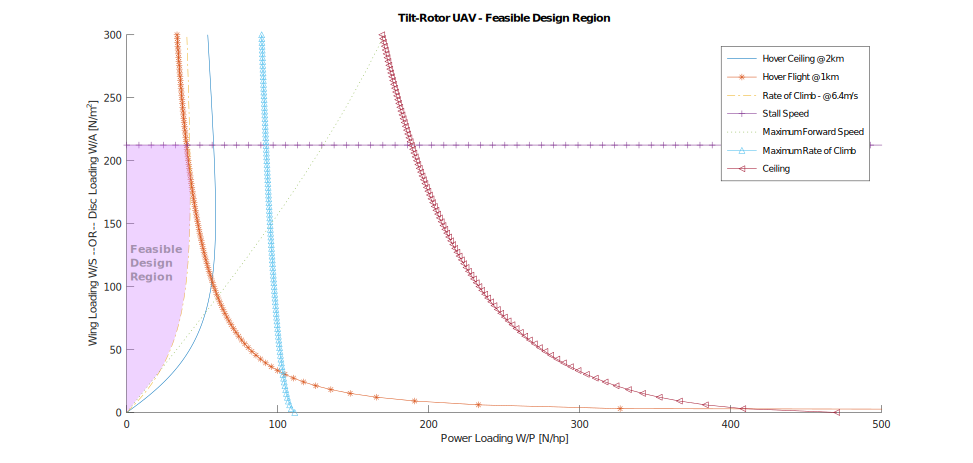
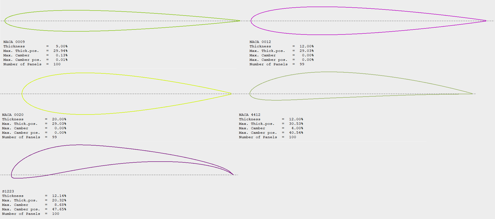
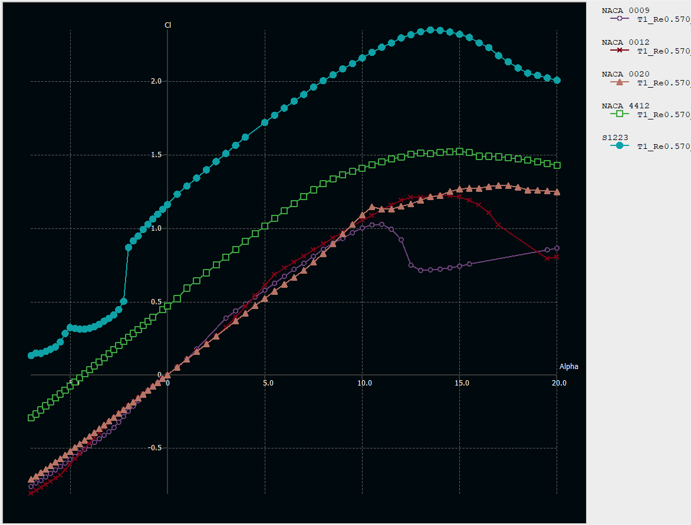
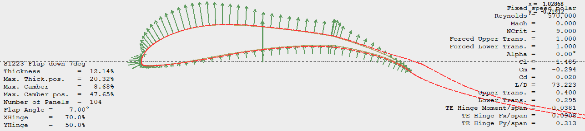
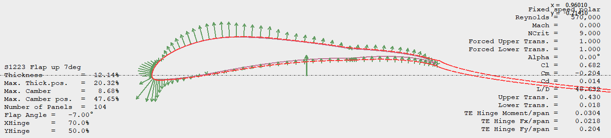
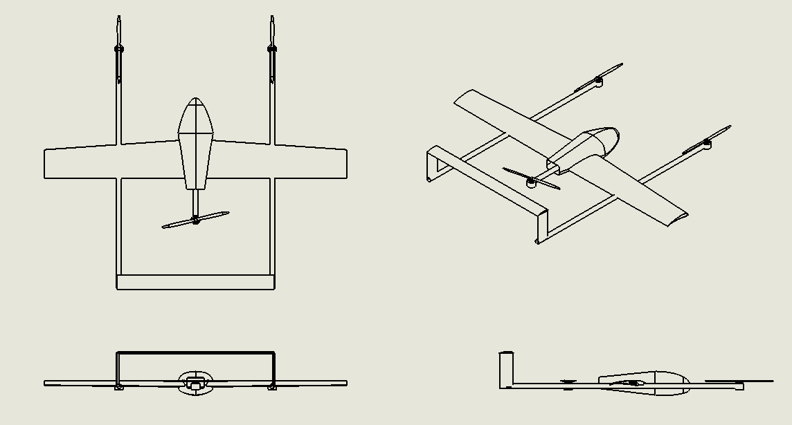
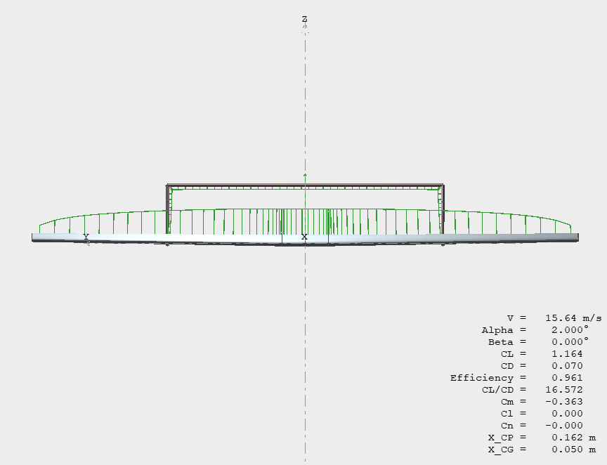

# Preliminary Geometrical Design and Analysis of a Tilt-Rotor Transitional UAV

<h2>Abstract</h2>

The present work included the preliminary geometrical design and analysis of a tilt-rotor transitional UAV based on combining the conventional approaches of fixed wing and multi-rotor design. Preliminary design parameters were derived using simulations in MATLAB/Octave, which formed the basis for the initial design geometry. The model aircraft was analysed using XFLR5 program for aerodynamic stability. Detailed CAD models were prepared using Solidworks software. RANS CFD simulations were performed using ANSYS Fluent to validate the design.
The proposed objectives of the project were successfully achieved. The various dimensions of Tilt-Rotor UAV including, but not limited to, area of the wing, rotor propeller size and power house requirement was computed and Lift force was correctly calculated. Pressure and velocity fields were visualised using ParaView and were found to be coherent with the expected phenomena.

<h2>At a glance</h2>

Figure 14 Wing Loading, Disc Loading vs Power Loading plot depicting feasible design region for complete Tilt-Rotor VTOL UAV

Figure 15 Aerofoils considered for main wing cross section

Figure 16 Coefficient of Lift (CL) vs Angle of Attack (alpha) plot for different Aerofoils at Reynolds number, Re = 570,000

Figure 21 S1223 Aerofoil with flap at 75% chord length in "down" position

Figure 22  S1223 Aerofoil with flap at 75% chord length in "up" position

Figure 28 Different Orthonormal Projected Views and Perspective view of the designed UAV

Figure 30 Distribution of Lift over the main wing and the elevator surfaces for stream velocity, v = 15.64 m/s, and angle of attack, alpha = 2.0 deg